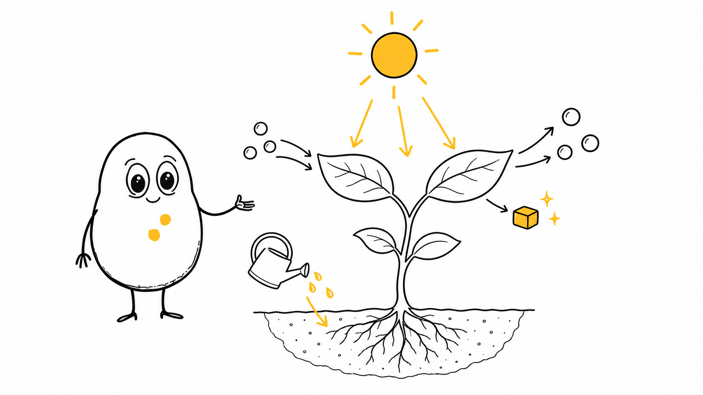
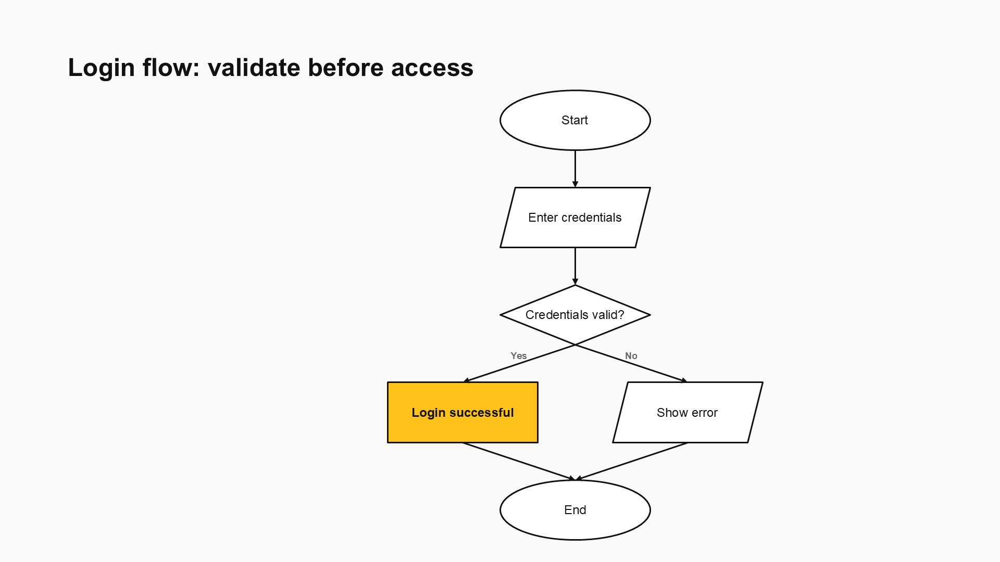
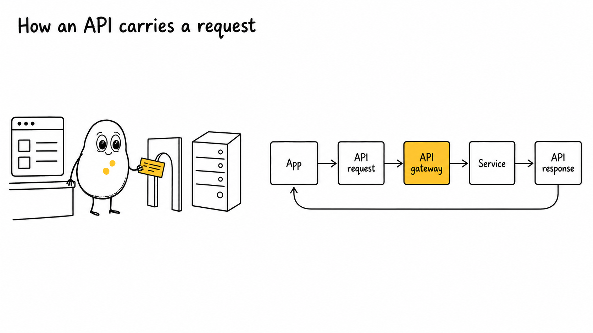
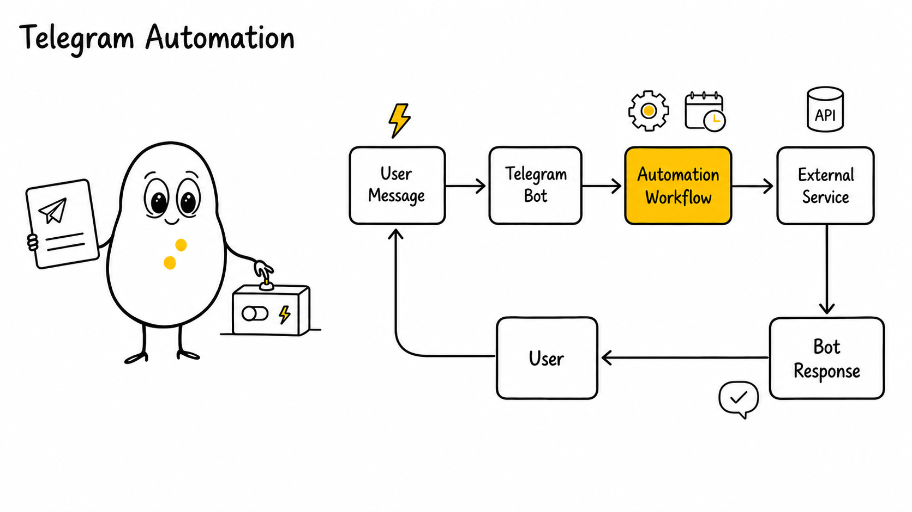

# ExplainDraw

### Turn ideas into illustrations, editable flowcharts, and hybrid presentation visuals

ExplainDraw is a reusable AI visual language and generation workflow for Codex, ChatGPT, and other capable AI agents. It transforms educational topics, technical systems, business processes, and abstract ideas into clean white-background visuals with a recognizable mascot, hand-drawn black lines, and focused yellow accents.

> One visual language. Three output modes. Natural-language input.

`Illustration` · `Flowchart` · `Hybrid` · `Editable PowerPoint` · `16:9` · `Codex Skill`

---

## See what it creates

### Illustration — explain a concept visually

The mascot participates in the explanation instead of appearing as decoration.



### Flowchart — communicate precise logic

Structured processes use standard shapes, readable labels, clear branches, and meaningful yellow emphasis. PowerPoint output can remain editable when presentation tools are available.



### Hybrid — combine a story with a system

Hybrid mode places a conceptual scene and structured technical flow in one balanced composition.



### More generated work — Telegram automation



More examples are available in [`examples/illustrations/`](examples/illustrations/) and [`examples/showcase/`](examples/showcase/).

---

## Choose the right mode

| What you need | Mode | Typical output |
|---|---|---|
| Analogy, educational scene, story, or mascot-led concept | Illustration | PNG image |
| Flowchart, architecture, timeline, decision tree, or pipeline | Diagram | Editable PPTX or PNG preview |
| Conceptual scene plus precise technical flow | Hybrid | 16:9 image or hybrid PPTX |

You do not need to prepare JSON. Describe the topic and desired output in natural language.

---

## Fastest way: use it in Codex

### Option 1 — ask Codex to install the skill

```text
Install the explaindraw/ skill from https://github.com/NLR-2007/illustrations
```

The portable skill lives in [`explaindraw/`](explaindraw/). After installation, start a new Codex thread and invoke it as `$explaindraw`.

```text
Use $explaindraw in illustration mode to explain photosynthesis to an eight-year-old.
```

```text
Use $explaindraw in diagram mode to create an editable PowerPoint flowchart for login and password reset.
```

```text
Use $explaindraw in hybrid mode to show how a Telegram bot triggers an automation workflow and returns a response.
```

### Option 2 — clone and use it from the repository

```bash
git clone https://github.com/NLR-2007/illustrations.git
cd illustrations
npm install
```

Then ask Codex:

```text
Read explaindraw/SKILL.md and create a hybrid visual explaining how an API gateway carries a request.
```

If Codex needs the local PowerPoint generator, it can run the CLI commands documented below.

---

## Use it in ChatGPT or another chat interface

Normal chat interfaces do not reliably install a GitHub repository as a persistent skill merely because a URL was pasted. Use one of these supported approaches.

### Method A — upload the prepared ZIP

1. Download [`release/explaindraw-chatgpt-upload.zip`](release/explaindraw-chatgpt-upload.zip).
2. Upload the ZIP to the chat.
3. Open [`share/CHATGPT_UPLOAD_PROMPT.txt`](share/CHATGPT_UPLOAD_PROMPT.txt), replace the request placeholder, and paste the complete prompt into the conversation.
4. Ask the chat to generate the image, flowchart, or hybrid visual.

Example:

```text
Use the uploaded ExplainDraw package in hybrid mode.
Create a 16:9 visual explaining Telegram automation:
User message → Telegram bot → Automation workflow → External service → Bot response.
Generate the actual image and follow the mascot and QA references in the package.
```

If the chat reports `Could not resolve host: github.com`, do not retry cloning. Upload the ZIP directly and say:

```text
Do not clone GitHub. Unpack the uploaded ZIP, read explaindraw/SKILL.md, and use ExplainDraw for my request.
```

### Method B — publish a custom GPT

For a permanent one-click chat experience, create a custom GPT named **ExplainDraw**:

1. Copy the contents of [`explaindraw/SKILL.md`](explaindraw/SKILL.md) into the GPT instructions.
2. Upload the `explaindraw/references/` files as knowledge.
3. Upload the mascot and example images from `explaindraw/assets/`.
4. Enable image generation.
5. Enable file/data-analysis capabilities if you want the GPT to create downloadable presentation files.
6. Publish the GPT and share its chat link.

Users can then request visuals without cloning or uploading the repository each time. Availability and usage limits depend on the user's chat plan and enabled tools.

### Method C — paste the repository link

Some chat environments can browse a public GitHub repository and follow its README directly. This may generate a correct illustration, but it is not guaranteed: repository browsing, file access, image generation, and code execution vary between products and plans. For repeatable behavior, prefer the ZIP or a published custom GPT.

---

## Visual identity

- Pure white `#FFFFFF` background
- Black or near-black `#111111` hand-drawn linework
- Yellow `#FFC21A` as the only accent color
- Thin, slightly imperfect outlines with generous negative space
- One continuous egg/potato-shaped mascot body—not separate head and torso shapes
- Large oval eyes with black pupils and white reflections
- Thin arms and legs
- Exactly two small organic yellow chest marks
- No gradients, shadows, 3D rendering, colored scenery, or unnecessary decoration

The full portable rules are in [`explaindraw/references/`](explaindraw/references/). Repository development references are in [`docs/`](docs/).

---

## Local automation engine

The repository includes a TypeScript engine for deterministic prompt packages and native editable PowerPoint diagrams.

### Route a general request

```bash
npm run generate -- --input examples/requests/api-analogy.json
```

### Create an editable PowerPoint diagram

```bash
npm run diagram -- --input examples/flowcharts/login-flow.json
```

### Create a hybrid slide package

```bash
npm run hybrid -- --input examples/hybrid/api-explanation.json
```

### Validate an output package

```bash
npm run validate -- --input output/api-restaurant-analogy
```

### Validate the portable skill

```bash
npm run validate:skill
```

---

## Image providers

The local engine supports three provider modes through `.env`:

- `manual` — always works offline and produces a complete prompt package
- `openai-compatible` — calls a configured compatible image API
- `custom-http` — sends generation requests to your own image service

```bash
cp .env.example .env
```

See [`docs/PROVIDERS.md`](docs/PROVIDERS.md) for configuration details.

The portable Codex skill can also call the image-generation tool already available in the host environment. When no image tool is available, it must identify the result as a prompt-only fallback rather than claiming that an image was rendered.

---

## Repository map

```text
.
├── explaindraw/              # Self-contained installable AI skill
│   ├── SKILL.md
│   ├── agents/
│   ├── assets/
│   └── references/
├── examples/
│   ├── showcase/             # Illustration, flowchart, hybrid, Telegram examples
│   ├── requests/             # Natural-language request fixtures
│   ├── flowcharts/           # Diagram topology examples
│   └── hybrid/               # Hybrid request examples
├── references/               # Source mascot and scene references
├── skills/                   # Repository-development mode instructions
├── docs/                     # Extended design and provider documentation
├── src/                      # TypeScript generation engine
├── scripts/                  # Skill validation tooling
├── tests/                    # Automated test suite
├── release/                  # Chat-interface upload package
└── share/                    # Ready-to-paste ChatGPT prompt
```

---

## Validation and reliability

Before publishing changes:

```bash
npm test
npm run build
npm run validate:skill
```

ExplainDraw validates skill structure, prompt rules, diagram topology, layout bounds, hybrid pane separation, mascot identity requirements, and palette compliance. AI-generated images can still vary, so visually review generated work before publication.

---

## License

- Code is licensed under the [`MIT License`](LICENSE).
- Mascot references and generated visual assets follow [`ASSET_LICENSE.md`](ASSET_LICENSE.md).

---

## Start creating

```text
Use $explaindraw to turn this topic into the clearest appropriate visual artifact:
[YOUR TOPIC]
```
