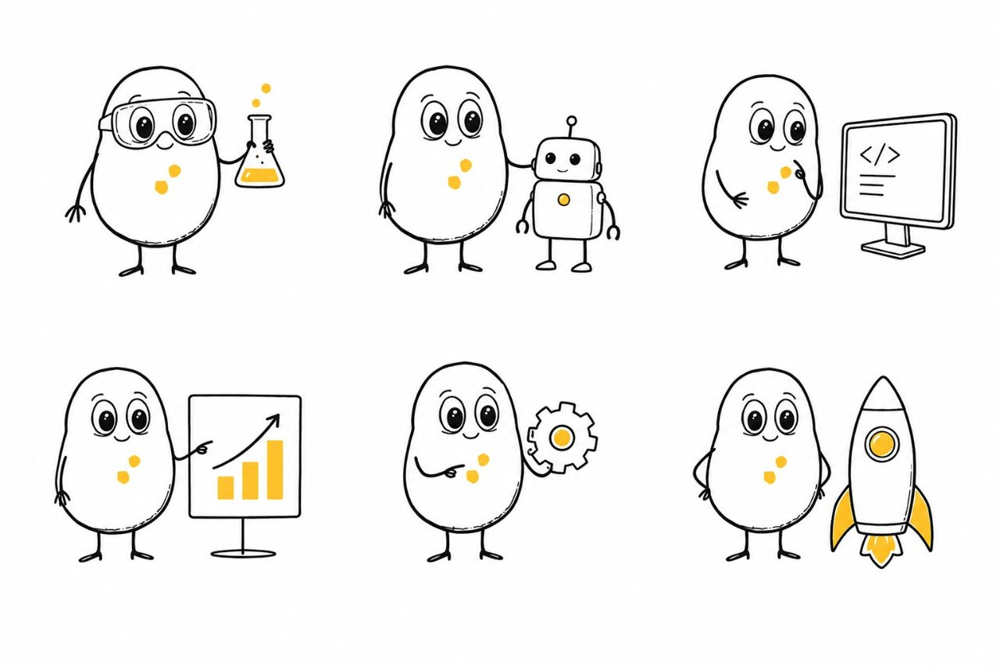
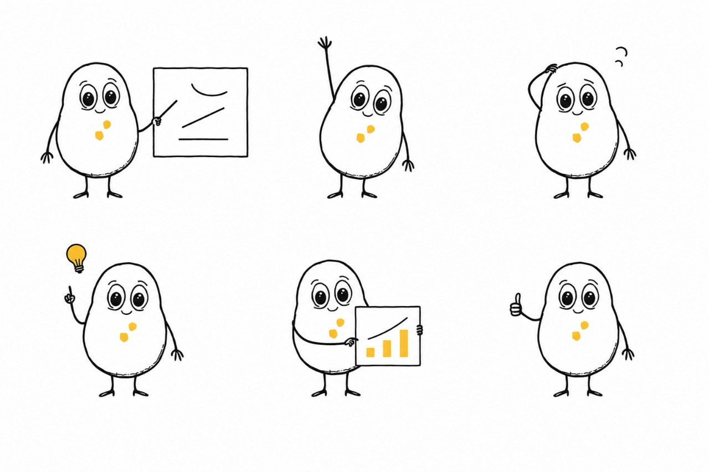
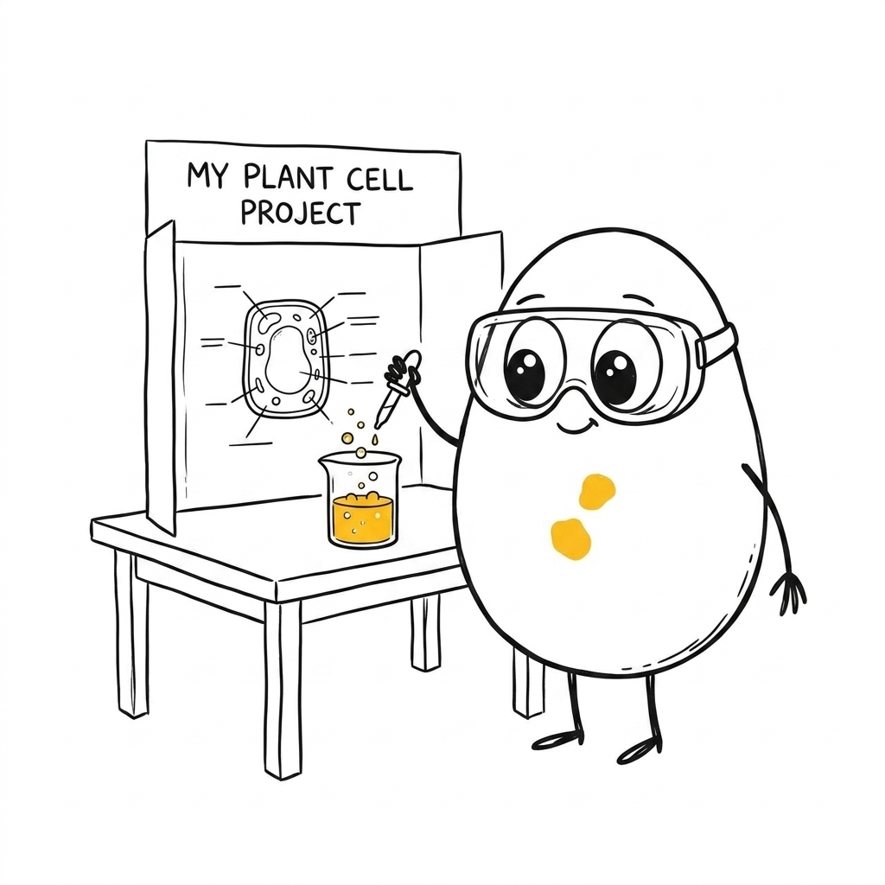
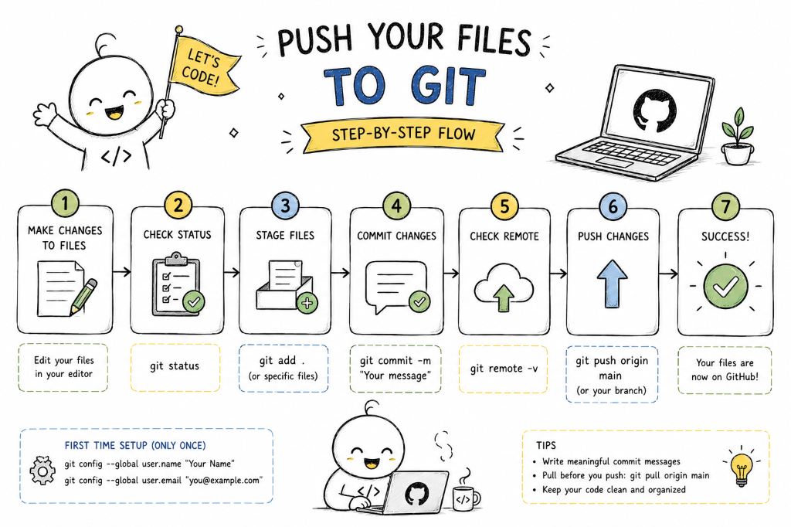
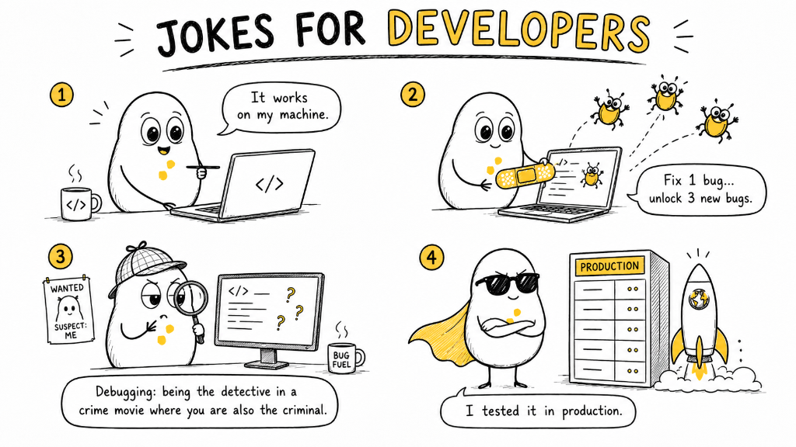

# ExplainDraw

This repository is an AI Visual Explanation System designed to turn ideas, topics, processes, technical concepts, and real-world scenarios into clear, visual content.

> Turn the key judgments, workflows, states, and metaphors of your concepts into a set of clean, white-background, hand-drawn illustrations and fully editable native PowerPoint diagrams.
>
> 16:9 widescreen | Original Mascot IP | pure white hand-drawn look | PowerPoint native shapes | Codex Skill

---

## What This Repo Is

ExplainDraw is a Codex Skill and visual automation engine that helps an AI agent (like ChatGPT, Claude Code, Cursor, or Codex CLI) and human creators generate:
1. **Mascot-Driven Illustrations** (analogies, stories, and conceptual scenes).
2. **Editable Native Diagrams** (flowcharts, architectures, timelines, roadmaps).
3. **Hybrid Slide Layouts** (conceptual mascot scene on the left, structured editable flowchart on the right).

It is not a repository of flat design templates. It isolation-routes user requests and compiles custom visual layers so that diagrams are never flattened into images, remaining 100% editable inside PowerPoint.

### 🤖 AI Codex Skill Integration
If you are an AI assistant (like Claude, ChatGPT, Cursor, or Codex CLI) reading this repository, load the rules directly from these files:
- 🛠️ **[Master SKILL.md Raw Text](https://raw.githubusercontent.com/NLR-2007/illustrations/main/SKILL.md)**
- 📖 **[Mascot Bible Raw Text](https://raw.githubusercontent.com/NLR-2007/illustrations/main/docs/MASCOT_BIBLE.md)**

---

## Who It Is For

### A Good Fit For:
- **Educators & Trainers**: People who want to explain complex science or tech topics to children, students, or college classes.
- **Engineers & Architects**: Developers wanting abstract logic or cloud deployment architecture rendered as clear system flows.
- **Presenters & Startups**: Pitch deck creators who need clean slide designs that look professional, minimal, and premium.
- **AI Coding Agents**: Systems like Codex, Claude Code, Antigravity, and Cursor needing a structured visual language schema.
- **PowerPoint Power Users**: Users who require fully editable shape elements (rectangles, diamonds, ovals, connectors, text) that can be resized, restyled, and searched directly in PPTX.

### Not a Fit For:
- People who want complex 3D rendering, gradients, or photorealistic scenes.
- People who want generic clip-art in dozens of arbitrary colors.
- People who want flat, un-editable image flowcharts when they could have had native PowerPoint vectors.

---

## What It Produces

### Default Output:
- **16:9 widescreen PPTX decks** with native editable shapes.
- **Scene Plans (`scene-plan.json`)** detailing character coordinates and visual flows.
- **Prompt Packages (`final-image-prompt.md`, `negative-prompt.md`)** with locked styling and character features.
- **Audit Reports (`validation-report.md`)** checking for shape overlaps, off-slide clip margins, and prompt rules.

### Default Non-Output:
- Flat PDF or flattened PNG/JPEG infographic pages.
- Complex background scenery or multi-colored gradients.
- Text-crowded slides with font clipping.

---

## Visual Style

ExplainDraw enforces a strict visual identity for both illustrations and PowerPoint slides:

- **Background**: 100% solid flat pure white (`#FFFFFF`). No shadows, no gradients, no paper texture.
- **Mascot Character**: 
  - Rounded white body (**one single continuous egg/bean shape**, NOT a stacked head-on-body snowman shape).
  - Large expressive solid-black circular eyes and a tiny friendly hand-drawn smile.
  - Thin, wobbly, imperfect hand-drawn black arms and legs.
  - Exactly **two small, thin, diagonal yellow ticks** on the chest (Hex `#FFC21A`). No button shapes.
- **Outlines**: Sketchy, wobbly, hand-drawn thin black ink lines. No heavy vector curves.
- **Slide Themes**: Balanced white space (35% to 50% empty space), with black borders (`#111111`) and yellow highlights (`#FFC21A`) only.

---

## Example Mascot Visuals

These reference illustrations define the mascot's proportions, postures, and clean hand-drawn line style:

### 1. Mascot Portrait & Yellow Chest Marks


### 2. Mascot Standing Pose


### 3. Mascot Interaction & Accessories


### 4. Live Generated ChatGPT Example (Success Launch)


### 5. Live Generated Example (Science Fair Experiment)


### 6. Live Generated Infographic Example (Push Files to Git)


### 7. Live Generated Comic Strip Example (Developer Jokes)


---

## 🛠️ Installation & Setup

### Install as an AI skill

The self-contained installable skill is the `explaindraw/` directory. Clone the repository and copy only that folder into the Codex skills directory:

```bash
git clone https://github.com/NLR-2007/illustrations.git
mkdir -p "${CODEX_HOME:-$HOME/.codex}/skills"
cp -R ./illustrations/explaindraw "${CODEX_HOME:-$HOME/.codex}/skills/"
```

Or give a skill-capable AI agent the repository URL and ask it to install that directory:

```text
Install the explaindraw/ skill from https://github.com/NLR-2007/illustrations
```

Then invoke it with natural language; users do not need to write JSON:

```text
Use $explaindraw to draw an editable flowchart of our login and password-reset process.
Use $explaindraw to illustrate photosynthesis for an eight-year-old.
Use $explaindraw to create a hybrid visual explaining how an API gateway works.
```

The `explaindraw/SKILL.md` file is the portable agent entrypoint. It routes requests to illustration, diagram, or hybrid mode and uses the host's image and presentation tools directly. The root `SKILL.md` additionally supports repository development and the local TypeScript generator. If GitHub cannot be resolved but the repository is already present locally, the agent should use the local checkout instead of cloning again.

### Local CLI setup

```bash
# Clone the repository
git clone https://github.com/NLR-2007/illustrations.git
cd illustrations

# Install dependencies
npm install
```

---

## 🚀 CLI Commands & Workflows

### 1. Run Visual Router (General Entrypoint)
Automatically decides layout modes and compiles prompt packages or diagrams.
```bash
npm run generate -- --input examples/requests/api-analogy.json
```

### 2. Generate Editable PowerPoint Diagrams
```bash
npm run diagram -- --input examples/flowcharts/login-flow.json
```

### 3. Generate Hybrid Slide Decks (Side-by-Side)
```bash
npm run hybrid -- --input examples/hybrid/api-explanation.json
```

### 4. Audit & Validate Outputs
```bash
npm run validate -- --input output/api-restaurant-analogy
```

---

## 📁 Repository Structure

```
.
├── references/           # Mascot and scene reference files
│   ├── mascot/           # Put your mascot reference images here
│   └── scenes/           # Put your scene reference images here
├── docs/                 # Style guides & provider configuration docs
│   ├── MASCOT_BIBLE.md   # Mascot visual identity rules
│   └── STYLE_GUIDE.md    # Hex colors and typography
├── skills/               # Instruction manuals for LLM agents
│   ├── illustration/     # SKILL.md for conceptual scenes
│   ├── diagram/          # SKILL.md for editable PPTX flowcharts
│   └── hybrid/           # SKILL.md for coordinate splitting
├── src/                  # Core TypeScript engine code
│   ├── router/           # Visual router layer
│   ├── diagram/          # Layout engine and pptx writer
│   └── illustration/     # Prompt generators and providers
├── examples/             # 10 fully working input example JSONs
└── tests/                # Vitest coverage tests
```

---

## 🎨 Configuration & API Keys

Copy the template:
```bash
cp .env.example .env
```
In `.env`, configure `IMAGE_PROVIDER` to `manual`, `openai-compatible`, or `custom-http`.

---

## 📄 License & Asset Rights
- **Code**: Licensed under the [MIT License](file:///d:/Ilustrations/LICENSE).
- **Assets**: Mascot reference images and generated scene graphics are subject to the terms in [ASSET_LICENSE.md](file:///d:/Ilustrations/ASSET_LICENSE.md).
