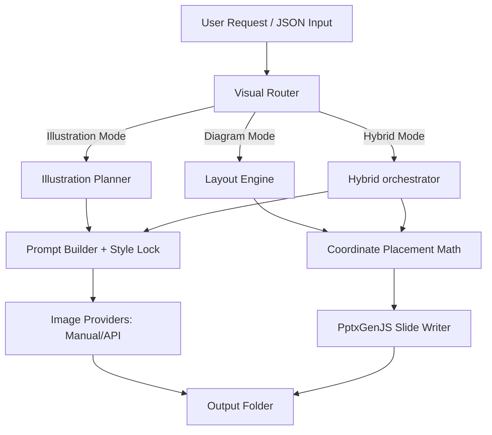

# ExplainDraw

> **Turn ideas into visuals people understand.**
>
> *Illustrations for stories. Editable diagrams for structure. Both when you need them.*

ExplainDraw is an open-source AI Visual Explanation System that turns ideas, processes, system architectures, and educational concepts into structured slides. It operates in three core visual modes:

1. **Illustration Mode**: Produces mascot-driven storyboards and analogy visuals.
2. **Editable Diagram Mode**: Generates native PowerPoint shapes, flowcharts, and timelines that remain fully editable.
3. **Hybrid Mode**: Combines conceptual mascot drawings on one side and structured native diagrams on the other.

---

## 🗺️ System Architecture



---

## ✨ Features

- **Mascot consistency**: Embeds strict rules (large black eyes, rounded white body, thin sketch limbs, two yellow chest marks) to lock visual identity across scenes.
- **100% Editable PowerPoint Outputs**: Rectangles stay rectangles, ovals stay ovals, text stays searchable and styled, and connecting lines stay editable vector connectors. No flat, rasterized diagrams.
- **Dynamic Text Fitting**: Programmatically checks text word wrapping. Shrinks font size or expands node widths automatically to prevent cutoffs.
- **Router Layer**: Automatically selects the best visual mode (Illustration, Diagram, or Hybrid) based on target audience (`CHILD_5_7`, `TEEN`, `PROFESSIONAL`, etc.) and keywords.
- **Key-free Local Operations**: Default `manual` mode compiles prompts, negative prompts, and visual plans without requiring any external subscription keys.

---

## 🛠️ Installation

```bash
# Clone the repository
git clone <repo-url>
cd ExplainDraw

# Install dependencies
npm install
```

---

## 🚀 Usage & CLI Examples

### 1. Run Router / General Generation
Routes input and builds illustrations, diagrams, or hybrids.
```bash
npm run generate -- --input examples/requests/api-analogy.json
```

### 2. Generate Editable PowerPoint Diagrams
Creates slide layouts directly from node-edge JSON schemas.
```bash
npm run diagram -- --input examples/flowcharts/login-flow.json
```

### 3. Generate Hybrid Presentation Slides
Creates a side-by-side layout: illustration prompt package on the left, editable system flow on the right.
```bash
npm run hybrid -- --input examples/hybrid/api-explanation.json
```

### 4. Validate Layout Quality
Validates overlaps, coordinate bounds, and prompt compliance.
```bash
npm run validate -- --input output/api-restaurant-analogy
```

---

## 📁 Project Structure

```
.
├── references/           # Target folders for mascot references
│   ├── mascot/           # Put your mascot reference images here
│   └── scenes/           # Put your scene reference images here
├── docs/                 # Detailed architecture & guides
│   ├── MASCOT_BIBLE.md   # Mascot visual identity rules
│   ├── STYLE_GUIDE.md    # Hex colors and typography
│   └── PROVIDERS.md      # API config rules
├── skills/               # Instruction manuals for LLM agents
├── src/                  # Core TypeScript engine
│   ├── router/           # AI visual router
│   ├── diagram/          # Coordinates and pptx rendering
│   └── illustration/     # Prompt locks and providers
├── examples/             # 10 comprehensive json examples
└── tests/                # Vitest coverage files
```

---

## 🎨 Configuration & API Keys

Copy the template:
```bash
cp .env.example .env
```
Inside `.env`, configure `IMAGE_PROVIDER` to `manual`, `openai-compatible`, or `custom-http`.

---

## 📄 License & Asset Rights
- **Code**: Licensed under the [MIT License](file:///d:/Ilustrations/LICENSE).
- **Assets**: Mascot reference images and generated scene graphics are subject to the terms in [ASSET_LICENSE.md](file:///d:/Ilustrations/ASSET_LICENSE.md).
