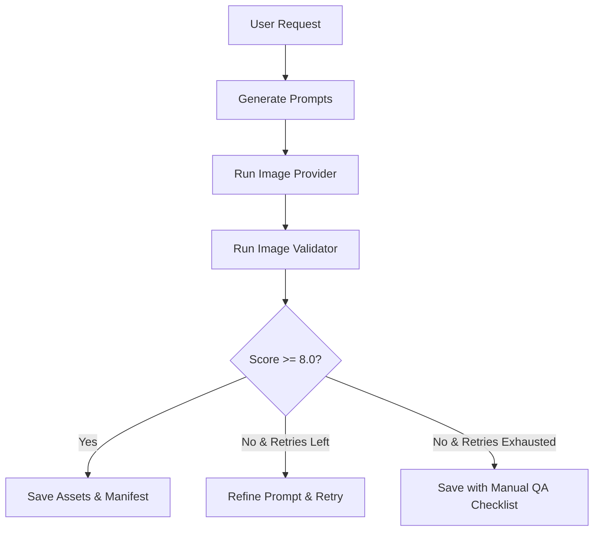

# Image Generation Rules & Consistency Pipeline

This document details how the AI prompt-generation system locks mascot identity and illustration styles. It also defines the verification and QA workflow.

---

## 1. Character & Style Lock Prompts

Every illustration prompt generated by the system must append these block specifications:

```
[CHARACTER LOCK: Simple mascot with a rounded soft white blob-like body, large expressive solid-black circular eyes, a tiny simple hand-drawn smile, thin sketchy hand-drawn black arms, thin sketchy hand-drawn black legs, and two small bright yellow chest marks. Proportions are short and friendly.]

[STYLE LOCK: Minimal editorial hand-drawn line-art illustration style. Clean, pure white background (#FFFFFF). Crisp black line-art drawings with bright yellow accent color only. Simple visual composition with lots of white space. Strictly NO photorealism, NO 3D rendering, NO complex gradients, NO background scenery, NO random clothing.]
```

---

## 2. Reusable Negative Prompt

The negative prompt is critical to prevent degradation. Use this negative prompt in all requests:

```
photorealistic, 3d render, blender, digital painting, oil painting, watercolor, complex background, scenery, shadows, gradients, realistic human anatomy, extra limbs, extra arms, extra legs, malformed hands, fingers, clothes, shirts, pants, hats, shoes, socks, missing chest marks, different colors, red, blue, green, text, letters, words, watermarks, logos, signature, frame, border
```

---

## 3. Consistency Pipeline

The generation engine uses a feedback loop:



### Validation Score Criteria
Each image is scored (automatically where computer vision is configured, or via a manual checklist) from `0.0` to `10.0`:

- **Mascot Identity (3 pts)**: Rounded white body, large black eyes, two yellow chest marks present.
- **Style Compliance (3 pts)**: Minimal hand-drawn line-art, white background, black outline, yellow accent only.
- **Content Accuracy (2 pts)**: Contains requested concepts and layout (e.g. restaurant table for API analogy).
- **Quality Check (2 pts)**: No text artifacts, no extra limbs, no extra colors.

---

## 4. Manual QA Review Checklist

When auto-validation cannot run or is inconclusive, the CLI outputs this QA checklist to the user's manifest:

1. **[ ] Mascot Face**: Are the eyes simple expressive black circles? Is there any realistic mouth/nose?
2. **[ ] Chest Marks**: Are the two small yellow chest marks visible?
3. **[ ] Color Compliance**: Is the background pure white? Are there any colors other than black, white, and yellow?
4. **[ ] Outline Quality**: Are outlines clean black hand-drawn sketch lines? (No 3D lighting or airbrushing).
5. **[ ] Composition**: Is the layout clean, uncluttered, and readable?
6. **[ ] Text & Logos**: Is the image free of gibberish text, logos, or watermarks?
